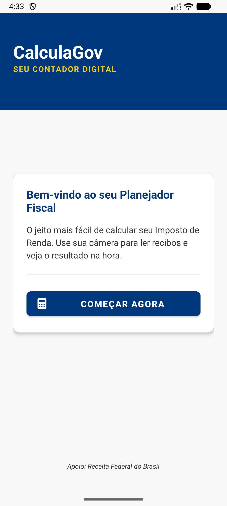
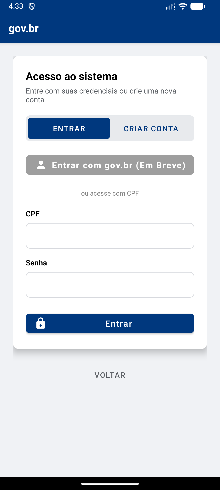
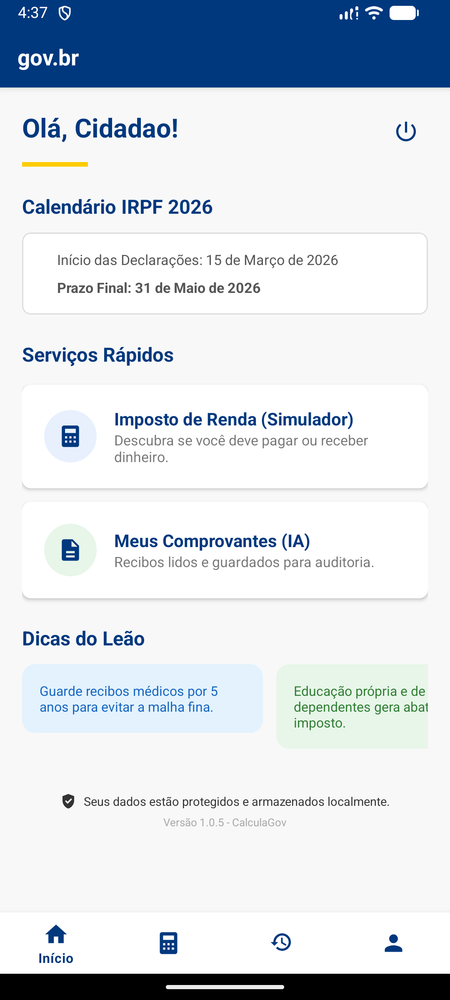
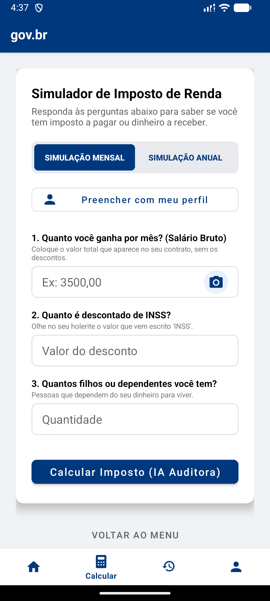
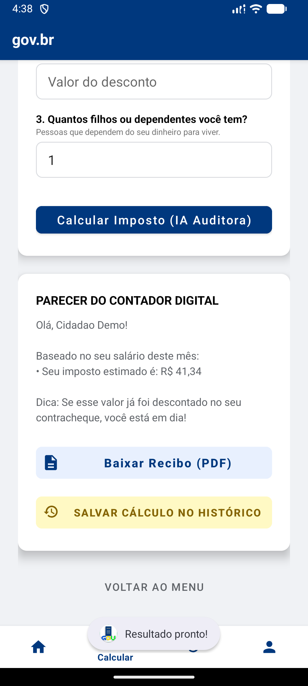
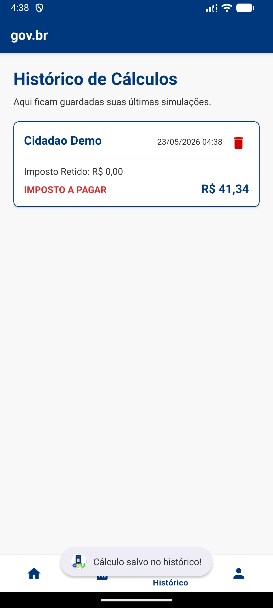
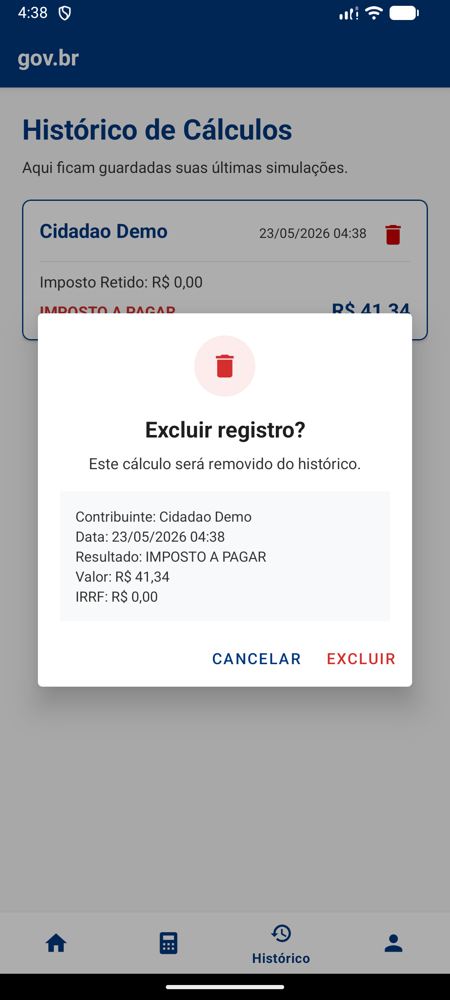

# 🇧🇷 CalculaGov - Seu Contador Digital IRPF 2026
> **🎓 Projeto de Extensão Universitária – Produção de Tecnologia Social**

O **CalculaGov** é um ecossistema digital mobile desenvolvido para democratizar o acesso à gestão fiscal no Brasil. Com identidade visual oficial do padrão **gov.br**, o app atua como um assistente completo para o IRPF 2026, integrando Inteligência Artificial, segurança biométrica e serviços públicos digitais.

---

## 📱 Screenshots do Aplicativo

Capturas realizadas no emulador Android com dados demonstrativos.

| Tela inicial | Login | Home |
|---|---|---|
|  |  |  |

| Simulador | Resultado | Histórico |
|---|---|---|
|  |  |  |

| Exclusão de registro |
|---|
|  |

---

## 📑 1. DIAGNÓSTICO E TEORIZAÇÃO

### 🤝 1.1 - Identificação das partes envolvidas e parceiros
- **Público-alvo:** Cidadãos de baixa e média renda (1 a 5 salários mínimos), trabalhadores assalariados e autônomos da comunidade local com dificuldade em organizar recibos e entender a legislação tributária.
- **Desenvolvedor:** Flavio Felipe – Aluno de Análise e Desenvolvimento de Sistemas.
- **Faculdade:** Estácio.

### ⚠️ 1.2 - Situação-problema identificada
A ausência de ferramentas gratuitas e acessíveis resulta em desorganização financeira (perda de recibos dedutíveis), gastos desnecessários com consultorias básicas e insegurança digital, levando muitos cidadãos à "Malha Fina" por erros que poderiam ser evitados com conferência prévia.

### 💡 1.3 - Demanda sociocomunitária e motivação acadêmica
O projeto atende à necessidade de transformar o celular em um **"contador de bolso"**. Academicamente, a motivação reside na aplicação prática de **Visão Computacional (ML Kit)**, **Segurança Mobile (Biometria)** e **Consumo de APIs Governamentais (Brasil API)**, consolidando conhecimentos técnicos voltados ao impacto social.

### 🎯 1.4 - Objetivos a serem alcançados
- ✅ Realizar simulações precisas de IRPF (Mensal e Anual).
- ✅ Automatizar a coleta de dados de recibos via OCR (Scanner de IA).
- ✅ Garantir 100% de privacidade através do isolamento de dados por CPF.
- ✅ Gerar dossiês em PDF com as fotos das evidências anexadas.

---

## 🚀 FUNCIONALIDADES DE IMPACTO

### 🔐 Segurança e Privacidade Multi-usuário
- **Isolamento Total:** Históricos de cálculos e pastas de fotos são criados dinamicamente usando o CPF como chave única.
- **Biometria Flexível:** O cidadão pode optar por exigir a digital para abrir áreas sensíveis através de um *switch* nas configurações de Perfil.
- **Backup Protegido:** Configuração que impede a extração de dados sensíveis via backups externos (ADB).

### 🤖 IA Auditora (OCR)
O módulo de simulação permite fotografar um recibo. A **IA (Google ML Kit)** identifica o valor mais relevante e preenche o campo automaticamente, reduzindo erros humanos de digitação.

### 🗺️ Integração Brasil API
No cadastro de perfil, ao digitar o CEP, o app utiliza **Retrofit** para preencher Cidade, UF e Logradouro instantaneamente, melhorando a experiência do usuário.

### 📅 Painel Dinâmico (Home)
- **Calendário Fiscal:** Exibição do prazo de entrega das declarações 2026.
- **Dicas do Leão:** Conteúdo educativo rotativo para prevenir erros fiscais e garantir direitos.

---

## 🛠️ 2. PLANEJAMENTO E METODOLOGIA

### 📅 2.1 - Plano de trabalho e Cronograma
1.  **Semanas 1-2:** Levantamento de requisitos e estudo da legislação tributária 2026.
2.  **Semanas 3-4:** Modelagem UI/UX seguindo o padrão oficial **gov.br**.
3.  **Semanas 5-8:** Desenvolvimento core: cálculos, integração Brasil API e ML Kit.
4.  **Semanas 9-10:** Implementação de segurança biométrica e isolamento multi-usuário.
5.  **Semanas 11-12:** Testes de estresse, validação de precisão e auditoria de privacidade.

### 🧪 2.2 - Metodologia (Tech Stack)
- **Linguagem:** Java (Android SDK).
- **Rede:** `Retrofit` + `Gson` (Integração Brasil API).
- **IA:** `Google ML Kit` (Extração de valores de imagens).
- **Relatórios:** `iText7` para exportação de PDFs de auditoria.

### 📊 2.3 - Avaliação dos resultados
O sucesso foi medido pela precisão matemática dos cálculos e pela eficácia da separação de diretórios `/Pictures/{CPF}`, garantindo que um usuário nunca acesse os documentos de outro no dispositivo.

---

## 📸 3. ENCERRAMENTO E EVIDÊNCIAS (3.1)

O desenvolvimento foi registrado através de:
1.  **Capturas de IDE:** Implementação do `BiometricHelper` e lógica de cálculo.
2.  **Auditoria de Arquivos:** Prova técnica do isolamento de pastas por CPF.
3.  **Simulação de Fluxo:** Scanner de IA extraindo dados de recibos reais.
4.  **Relatórios Gerados:** Documentos PDF unindo cálculos e imagens de evidências.

---

## ⚙️ Como Executar
1. Clone o repositório.
2. Abra no **Android Studio**.
3. Realize o **Gradle Sync**.
4. Execute em um emulador ou dispositivo (Android 7.0+).

---
*⚠️ **Aviso:** Este aplicativo é uma ferramenta de simulação pedagógica. Os dados finais devem sempre ser validados no programa oficial da Receita Federal.*
